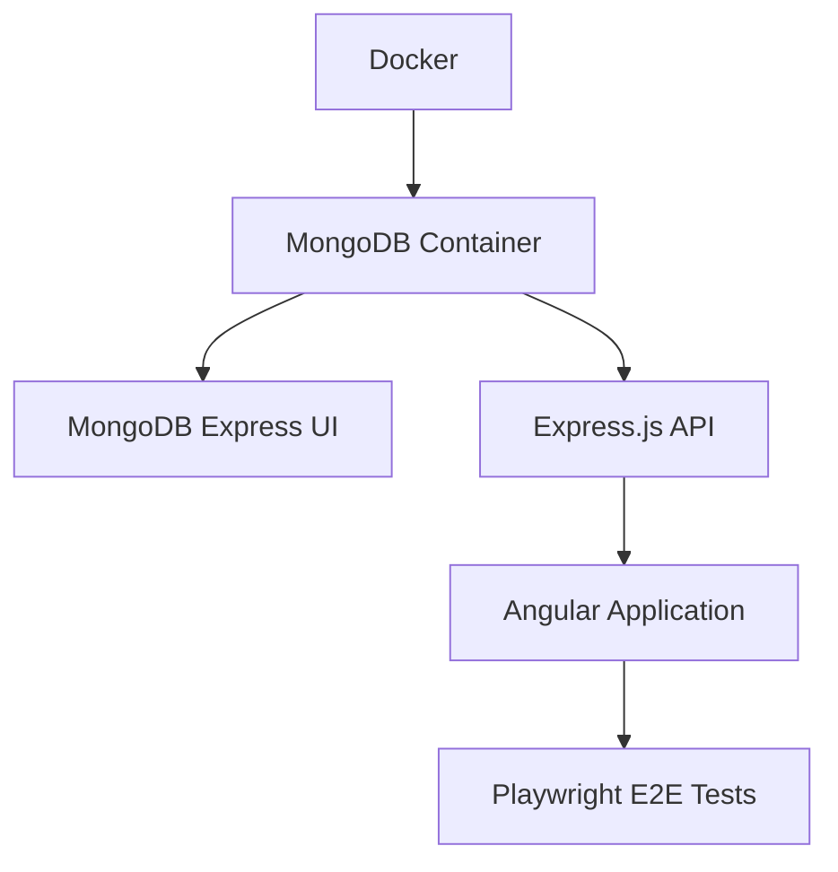

# 🚀 Angular Todo Application - Complete Startup Guide

**Last Updated**: October 3, 2025  
**Application Status**: ✅ **FULLY OPERATIONAL WITH E2E TESTING**

## 📋 Overview

This document provides comprehensive instructions for starting and testing the Angular 18 Todo Full-Stack Application with the **mandatory service startup sequence** required for proper operation and E2E testing.

## 🎯 **CRITICAL: Service Startup Sequence**

The application stack **MUST** be started in this specific order:

```
Database Layer → Backend API → Frontend Application → E2E Testing
```

### **Why This Order Matters**
- **Backend API** depends on **MongoDB** for database connections
- **Angular Frontend** depends on **Backend API** for data and authentication
- **E2E Tests** require all services to be operational and stable
- **Improper order** causes connection failures and test instability

## 🚀 **Quick Start Commands**

### **Option 1: Automated Startup with E2E Testing (RECOMMENDED)**
```bash
# Comprehensive startup and testing
./run-e2e-tests.sh

# Run specific test suites
./run-e2e-tests.sh auth        # Authentication tests only
./run-e2e-tests.sh dashboard   # Dashboard functionality tests
./run-e2e-tests.sh workflows   # Complete user workflows
./run-e2e-tests.sh ui          # Interactive UI mode
./run-e2e-tests.sh headed      # Visible browser mode
```

### **Option 2: Automated Startup for Development**
```bash
# Start all services in proper sequence
./start-dev.sh

# Stop all services
./stop-dev.sh
```

### **Option 3: Manual Step-by-Step Startup**
```bash
# Step 1: Database Layer (15-20 seconds)
cd data-base/mongodb
docker-compose up -d
sleep 15

# Step 2: Backend API (10-15 seconds)
cd ../../Back-End/express-rest-todo-api
npm start &
sleep 10

# Step 3: Frontend Application (20-30 seconds)
cd ../../Front-End/angular-18-todo-app
ng serve --proxy-config proxy.conf.json &
sleep 20

# Step 4: Verify all services
curl http://localhost:3000/health && curl -s http://localhost:4200 > /dev/null
echo "All services ready!"
```

## 🔍 **Service Health Verification**

### **Database Layer Health Check**
```bash
# Check MongoDB container
docker ps | grep angular-todo-mongodb

# Test MongoDB connection
docker exec angular-todo-mongodb mongosh --eval "db.adminCommand('ping')"

# Check MongoDB Express UI
curl -s http://localhost:8081
```

### **Backend API Health Check**
```bash
# Test API health endpoint
curl http://localhost:3000/health

# Expected response: {"status":"OK","timestamp":"...","services":{"database":"connected"}}

# Test API authentication endpoint
curl http://localhost:3000/api/auth/health
```

### **Frontend Application Health Check**
```bash
# Test Angular application
curl -s -o /dev/null -w "%{http_code}" http://localhost:4200

# Expected response: 200

# Check Angular development server process
ps aux | grep "ng serve" | grep -v grep
```

### **Comprehensive Health Check**
```bash
# All services health verification
./run-e2e-tests.sh --health-check-only
```

## 🌐 **Service Access Points**

Once all services are running:

| Service | URL | Purpose |
|---------|-----|---------|
| **Angular Application** | http://localhost:4200 | Main todo application |
| **Express.js API** | http://localhost:3000 | REST API endpoints |
| **API Documentation** | http://localhost:3000/api-docs | Swagger documentation |
| **API Health Check** | http://localhost:3000/health | Backend health status |
| **MongoDB Express UI** | http://localhost:8081 | Database management |
| **HTML Wireframes** | http://localhost:8080 | UI/UX documentation |

## 🧪 **E2E Testing Execution**

### **Prerequisites for E2E Testing**
1. ✅ All services running in correct sequence
2. ✅ Health checks passing for all services
3. ✅ Playwright dependencies installed
4. ✅ Browser drivers available

### **E2E Test Execution Options**
```bash
# Full test suite execution
./run-e2e-tests.sh

# Specific test categories
./run-e2e-tests.sh auth        # Authentication flow tests
./run-e2e-tests.sh dashboard   # Todo/List management tests
./run-e2e-tests.sh workflows   # Complete user journey tests

# Interactive testing modes
./run-e2e-tests.sh ui          # Interactive UI for test debugging
./run-e2e-tests.sh headed      # Run tests with visible browser
./run-e2e-tests.sh debug       # Debug mode with breakpoints

# Direct Playwright execution (after services are running)
cd Front-End/angular-18-todo-app
npm run test:e2e               # All tests
npm run test:e2e:ui            # Interactive mode
npm run test:e2e:headed        # Visible browser
npm run test:e2e:debug         # Debug mode
```

### **Test Coverage**
- **Authentication Tests**: Login, register, validation, navigation
- **Dashboard Tests**: Todo CRUD, list management, filtering, search
- **Workflow Tests**: Complete user journeys, mobile responsive, performance
- **Browser Coverage**: Chrome, Firefox, Safari, Mobile Chrome, Mobile Safari
- **Total Scenarios**: 45+ individual test cases across 5 browser configurations

## 🔧 **Troubleshooting**

### **Common Issues and Solutions**

#### **Issue: "Connection Refused" in E2E Tests**
**Cause**: Services not started in proper sequence or not fully ready
**Solution**:
```bash
# Stop all services
./stop-dev.sh

# Wait 10 seconds
sleep 10

# Restart with proper sequence
./run-e2e-tests.sh
```

#### **Issue: MongoDB Connection Fails**
**Cause**: Docker containers not running or not ready
**Solution**:
```bash
# Check Docker containers
docker ps | grep mongo

# Restart MongoDB
cd data-base/mongodb
docker-compose down
docker-compose up -d
sleep 15
```

#### **Issue: Backend API Not Responding**
**Cause**: Missing .env file or MongoDB not connected
**Solution**:
```bash
# Check .env file exists
ls -la Back-End/express-rest-todo-api/.env

# Check backend logs
cd Back-End/express-rest-todo-api
npm start
# Watch for MongoDB connection messages
```

#### **Issue: Angular Application Not Loading**
**Cause**: Build errors or proxy configuration issues
**Solution**:
```bash
# Clear node_modules and reinstall
cd Front-End/angular-18-todo-app
rm -rf node_modules package-lock.json
npm install

# Start with verbose logging
ng serve --proxy-config proxy.conf.json --verbose
```

### **Service Logs and Debugging**
```bash
# View backend logs
tail -f /tmp/backend-e2e.log

# View frontend logs
tail -f /tmp/frontend-e2e.log

# View Docker container logs
docker logs angular-todo-mongodb
docker logs angular-todo-mongo-ui

# View Playwright test results
open Front-End/angular-18-todo-app/playwright-report/index.html
```

## 📊 **Service Dependencies and Timing**

### **Startup Timing Requirements**
- **MongoDB**: 15-20 seconds (initial container startup)
- **Express.js API**: 5-10 seconds (after MongoDB ready)
- **Angular Application**: 20-30 seconds (initial compilation)
- **Total Startup Time**: 40-60 seconds for all services

### **Service Dependencies**


### **Port Usage**
- **27017**: MongoDB Database
- **8081**: MongoDB Express UI
- **3000**: Express.js API Server
- **4200**: Angular Development Server
- **8080**: HTML Wireframes Server (optional)

## 🎉 **Success Indicators**

### **All Services Ready Checklist**
- [ ] ✅ MongoDB responding to ping commands
- [ ] ✅ MongoDB Express UI accessible
- [ ] ✅ Express.js API health check returns 200
- [ ] ✅ Angular application loads without errors
- [ ] ✅ E2E tests can connect to all services
- [ ] ✅ All health checks passing

### **Ready for Development**
When you see all these indicators:
```
✅ MongoDB: Healthy
✅ MongoDB Express: Healthy  
✅ Express.js API: Healthy (HTTP 200)
✅ Angular Application: Healthy (HTTP 200)
🎉 ALL SERVICES ARE HEALTHY AND READY!
```

## 🎯 **Next Steps**

1. **Development**: Access application at http://localhost:4200
2. **API Testing**: Use Swagger documentation at http://localhost:3000/api-docs
3. **Database Management**: Use MongoDB Express at http://localhost:8081
4. **E2E Testing**: Run comprehensive tests with `./run-e2e-tests.sh`
5. **Wireframe Review**: View UI documentation at http://localhost:8080

---

**🚀 Your Angular 18 Todo Full-Stack Application is ready for development and testing!**