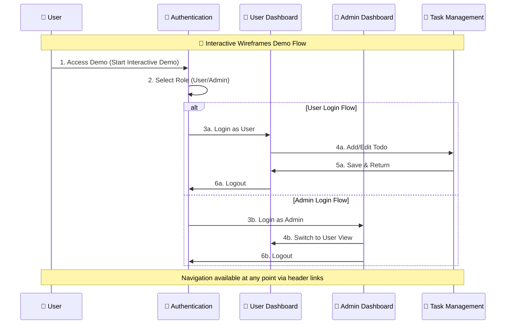

# 🎯 Angular 18 Todo Full-Stack Application

A comprehensive todo management application built with Angular 18, featuring role-based authentication, advanced task management, and administrative capabilities.

## 📋 Project Overview

This project provides a complete solution for task management with:
- **Role-based Authentication** (User/Admin)
- **Advanced Todo Management** (Categories, Priorities, Due dates, Subtasks)
- **Admin Panel** (User management, System monitoring)
- **Interactive Wireframes** (Complete UI/UX prototypes)
- **E2E Testing** (Comprehensive Playwright test suite)

## 🚀 Quick Start - Interactive Wireframes Demo

### 🎮 Start the Demo

```bash
# Navigate to wireframes directory
cd wireframes-and-design

# Start the demo server
./start-wireframes-demo.sh
```

The script will:
- ✅ Start Python HTTP server on port 8080
- 🌐 Open browser to http://localhost:8080
- 📊 Display server status and PID
- 💡 Show navigation instructions

### 🛑 Stop the Demo

```bash
# Stop the demo server
./stop-wireframes-demo.sh
```

## 🔄 Interactive Navigation Flow

### 📊 Sequence Flow Diagram



### 🎯 Navigation Guide

| From | To | Action | Link |
|------|-------|--------|------|
| 🏠 **Main Index** | 🔐 Authentication | Click "🚀 Start Interactive Demo" | [Demo Start](http://localhost:8080/) |
| 🔐 **Authentication** | 👤 User Dashboard | Select "User Login" → Click "Login" | [User Login](http://localhost:8080/wireframes/desktop/01-authentication.html) |
| 🔐 **Authentication** | 🔧 Admin Dashboard | Select "Admin Login" → Click "Login" | [Admin Login](http://localhost:8080/wireframes/desktop/01-authentication.html) |
| 👤 **User Dashboard** | 📝 Task Management | Click "Add Todo" or Edit (✏️) button | [User Dashboard](http://localhost:8080/wireframes/desktop/02-user-dashboard.html) |
| 🔧 **Admin Dashboard** | 👤 User Dashboard | Click "Switch to User" | [Admin Dashboard](http://localhost:8080/wireframes/desktop/03-admin-dashboard.html) |
| Any Page | 🏠 Main Index | Click "← Back to Overview" | Navigation Header |
| Any Page | Any Other Page | Use navigation header tabs | Navigation Header |

## 🎨 Wireframes & Design

### 📁 Structure
```
wireframes-and-design/
├── index.html                     # 📋 Main overview & navigation
├── start-wireframes-demo.sh       # 🚀 Demo startup script  
├── stop-wireframes-demo.sh        # 🛑 Demo shutdown script
├── wireframes/
│   └── desktop/
│       ├── 01-authentication.html # 🔐 Login/Register/Password Reset
│       ├── 02-user-dashboard.html # 👤 User interface & todo management
│       ├── 03-admin-dashboard.html# 🔧 Admin panel & user management
│       └── 04-task-management.html# 📝 Advanced todo creation/editing
└── documentation/
    └── design-specification.md    # 📚 Complete design guide
```

### 🎮 Interactive Features

| Feature | Description | Location |
|---------|-------------|----------|
| **Role-based Login** | Switch between User/Admin dashboards | Authentication Page |
| **Form Navigation** | Switch between Login/Registration forms | Authentication Page |
| **Todo Management** | Add/Edit todos with advanced features | User Dashboard |
| **Admin Actions** | User management and system monitoring | Admin Dashboard |
| **Cross-navigation** | Jump between any wireframe | All Pages (Header) |

## 📱 Demo URLs (When Server Running)

| Page | URL | Description |
|------|-----|-------------|
| 🏠 **Main Overview** | http://localhost:8080/ | Project documentation & demo start |
| 🔐 **Authentication** | http://localhost:8080/wireframes/desktop/01-authentication.html | Login/Register forms with role selection |
| 👤 **User Dashboard** | http://localhost:8080/wireframes/desktop/02-user-dashboard.html | Todo management interface |
| 🔧 **Admin Dashboard** | http://localhost:8080/wireframes/desktop/03-admin-dashboard.html | Administrative panel |
| 📝 **Task Management** | http://localhost:8080/wireframes/desktop/04-task-management.html | Advanced todo creation/editing |

## 🏗️ Angular Application

### 📂 Frontend Structure
```
angular-18-front-end/
├── src/app/
│   ├── components/          # UI components
│   ├── services/           # Business logic & API calls
│   ├── models/             # TypeScript interfaces
│   ├── guards/             # Route protection
│   └── interceptors/       # HTTP middleware
├── e2e/                    # Playwright E2E tests
├── db.json                 # JSON server mock data
└── playwright.config.ts    # E2E test configuration
```

### 🧪 Testing

```bash
# Navigate to Angular app
cd angular-18-front-end

# Run E2E tests
npm run test:e2e

# Run E2E tests in headed mode (see browser)
npm run test:e2e:headed

# Run E2E tests with UI
npm run test:e2e:ui
```

## 📚 Documentation

### 📖 Available Documents

| Document | Location | Description |
|----------|----------|-------------|
| **Requirements** | `requirements.md` | Original project requirements |
| **Optimized Requirements** | `REQUIREMENTS-OPTIMIZED.md` | Enhanced requirements based on wireframes |
| **Design Specification** | `wireframes-and-design/documentation/design-specification.md` | Complete UI/UX design guide |
| **Test Coverage** | `angular-18-front-end/TEST-COVERAGE-ANALYSIS.md` | E2E test documentation |

## 🔧 Development Setup

### Prerequisites
- Node.js 18+ 
- Python 3 (for wireframes demo)
- Modern browser (Chrome/Firefox/Safari)

### 🚀 Quick Setup

```bash
# 1. Wireframes Demo
cd wireframes-and-design
./start-wireframes-demo.sh

# 2. Angular Development (separate terminal)
cd angular-18-front-end
npm install
npm start

# 3. JSON Server (separate terminal)
cd angular-18-front-end  
npm run start:json-server
```

## 🎯 Key Features Demonstrated

### 🔐 Authentication System
- Role-based login (User/Admin)
- Registration with validation
- Password recovery flow
- Role selection interface

### 👤 User Dashboard
- Personal todo management
- Category-based organization  
- Priority and due date handling
- Search and filtering
- Statistics overview

### 🔧 Admin Dashboard
- User management (view, edit, block, delete)
- System monitoring and health checks
- Activity tracking and audit logs
- Quick administrative actions

### 📝 Task Management
- Advanced todo creation
- Priority levels (High/Medium/Low)
- Category management
- File attachments
- Subtask handling
- Tags system
- Due date scheduling

## 🌐 Browser Compatibility

| Browser | Version | Status |
|---------|---------|--------|
| Chrome | 90+ | ✅ Fully Supported |
| Firefox | 88+ | ✅ Fully Supported |
| Safari | 14+ | ✅ Fully Supported |
| Edge | 90+ | ✅ Fully Supported |

## 📞 Support & Contact

- **Project**: Angular 18 Todo Full-Stack Application
- **Version**: 1.0
- **Created**: September 2024
- **Technology Stack**: Angular 18, TypeScript, Python (demo server), Playwright (testing)

## 🔄 Quick Navigation Commands

```bash
# Start wireframes demo
cd wireframes-and-design && ./start-wireframes-demo.sh

# Stop wireframes demo
cd wireframes-and-design && ./stop-wireframes-demo.sh

# Start Angular development
cd angular-18-front-end && npm start

# Run E2E tests
cd angular-18-front-end && npm run test:e2e

# View project in browser
open http://localhost:8080  # Wireframes
open http://localhost:4200  # Angular App
```

---

**🎯 Ready to explore? Start with the [Interactive Wireframes Demo](wireframes-and-design/) or dive into the [Angular Application](angular-18-front-end/)!**